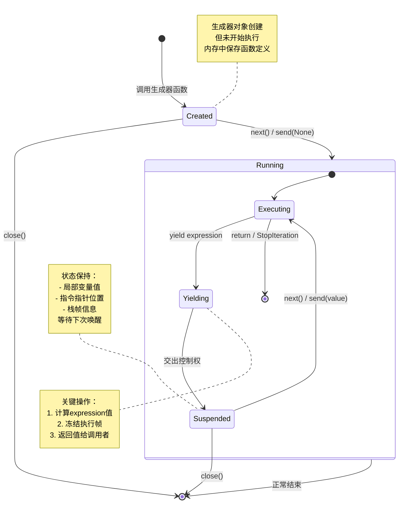
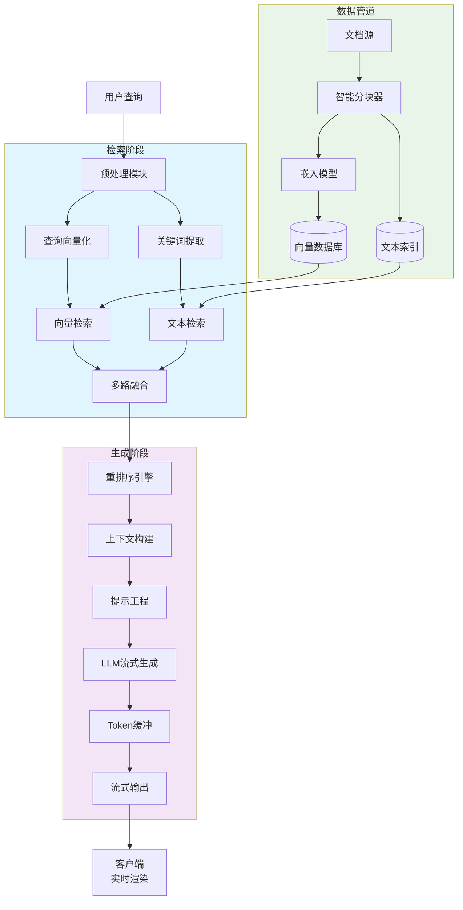
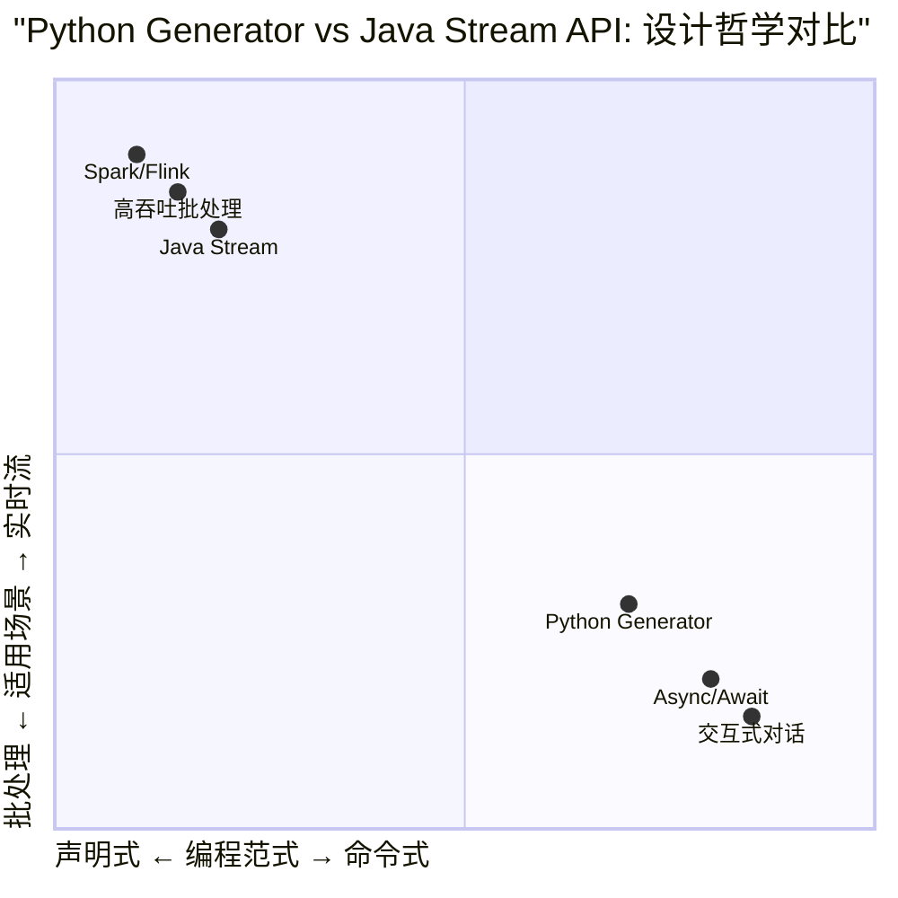
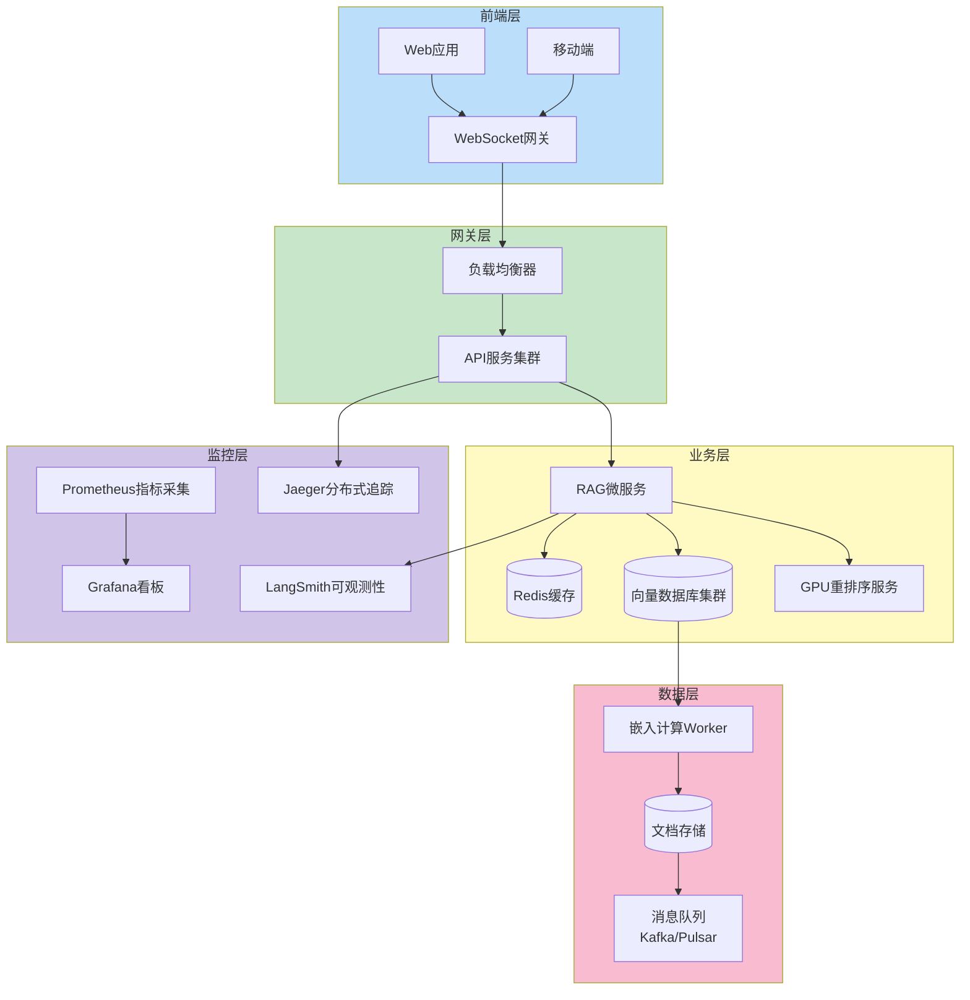

# Day 3 知识图解：生成器工程化应用可视化

## 图1：生成器状态机与执行流程

**执行时序说明**：

1. **创建阶段**：调用生成器函数返回生成器对象，代码未执行
2. **首次唤醒**：调用`next(gen)`进入Running状态，执行到第一个`yield`
3. **产出值**：计算yield表达式，返回值，转入Suspended状态
4. **恢复执行**：再次调用`next(gen)`或`gen.send(value)`，从yield后继续
5. **循环**：重复3-4步骤，直到函数返回或抛出StopIteration
6. **异常处理**：调用`gen.close()`可提前终止，清理资源

## 图2：流式RAG生成器管道架构

**组件说明**：

- **智能分块器**：基于DeepDoc等深度文档理解，识别标题、段落、表格、图片
- **多路融合**：结合向量检索（语义相似度）与文本检索（关键词匹配）
- **重排序引擎**：使用交叉编码器（Cross-Encoder）精细排序，如BGE-Reranker
- **LLM流式生成**：异步生成器逐Token产出，支持打字机效果
- **Token缓冲**：管理网络抖动，平滑输出速率

## 图3：Python生成器 vs Java Stream API对比（设计哲学）

**核心差异分析**：

| 特性         | Java Stream            | Python Generator             |
| ------------ | ---------------------- | ---------------------------- |
| **数据模型** | 集合→管道→终端操作     | 可暂停函数→惰性序列          |
| **并发支持** | 并行流（ForkJoinPool） | 异步生成器（asyncio）        |
| **状态管理** | 无状态操作链           | 函数帧完整状态保存           |
| **错误处理** | 终端操作抛出异常       | 可在yield点捕获恢复          |
| **内存模式** | 有状态操作需全量缓存   | 始终增量生成O(1)             |
| **适用场景** | ETL流水线、数据分析    | 实时聊天、流式API、I/O密集型 |

## 图4：企业级流式RAG系统部署拓扑

**企业级考量**：

1. **水平扩展**：API服务无状态，可横向扩展应对高并发
2. **GPU加速**：重排序、嵌入计算卸载到专用GPU节点
3. **最终一致性**：文档更新通过消息队列异步同步到向量库
4. **可观测性**：全链路追踪、Token消耗监控、响应延迟告警
