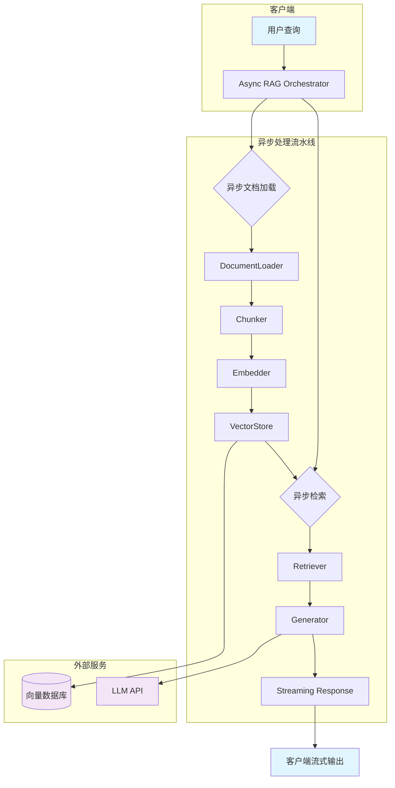

# 异步RAG生成器设计文档

## 1. 概述

本设计文档描述了一个企业级异步RAG（检索增强生成）生成器的系统架构与实现方案。该系统面向高并发AI Agent场景，支持流式文档检索与实时生成，融合异步编程、连接池、批处理等工程优化策略，满足大规模生产环境需求。

## 2. 系统架构图



## 3. 组件职责

### 3.1 Async RAG Orchestrator

- **职责**：协调整个异步RAG流程，管理并发任务与错误恢复
- **关键特性**：
  - 基于`asyncio.gather`的并行执行
  - 超时控制与重试机制
  - 流量限制与熔断器

### 3.2 DocumentLoader

- **职责**：异步加载多种格式的文档（PDF、TXT、DOCX、Markdown）
- **实现方式**：
  - 使用`aiofiles`进行异步文件读取
  - 支持远程URL文档下载（`aiohttp`）
  - 可配置的元数据提取

### 3.3 Chunker

- **职责**：将文档分割为语义连贯的文本块
- **算法**：
  - 递归字符分割（RecursiveCharacterTextSplitter）
  - 重叠窗口（overlap）保持上下文连贯
  - 异步批处理分块

### 3.4 Embedder

- **职责**：将文本块异步转换为向量嵌入
- **实现**：
  - 支持OpenAI、Sentence‑Transformers等嵌入模型
  - 异步批处理（减少API调用延迟）
  - 缓存层减少重复计算

### 3.5 VectorStore

- **职责**：提供向量检索的异步接口
- **支持后端**：
  - Qdrant（异步客户端`qdrant‑async`）
  - Pinecone（官方异步SDK）
  - 本地FAISS（异步封装）
- **特性**：
  - 连接池管理
  - 多路召回（Hybrid Search）支持

### 3.6 Retriever

- **职责**：执行检索逻辑，包括重排序与过滤
- **策略**：
  - 基于余弦相似度的Top‑K召回
  - 交叉编码器重排序（可选）
  - 元数据过滤（日期、来源等）

### 3.7 Generator

- **职责**：基于检索结果流式生成回答
- **核心机制**：
  - 异步生成器（`async generator`）逐token产出
  - 提示工程模板
  - 响应后处理（引用标注、格式美化）

## 4. 异步数据流

### 4.1 正常流程

```
1. 接收用户查询（异步API端点）
2. 并行执行：
   - 文档加载与分块（若缓存未命中）
   - 查询向量嵌入生成
3. 异步检索：向量数据库召回Top‑K片段
4. 重排序与上下文组装
5. 流式生成：通过异步生成器逐token返回
6. 实时返回客户端（Server‑Sent Events或WebSocket）
```

### 4.2 并发控制

- **Semaphore限制最大并发数**：防止资源耗尽
- **连接池复用**：数据库/API连接
- **批量操作**：嵌入与检索的批处理提升吞吐

## 5. 错误处理机制

### 5.1 重试策略

- **指数退避**：网络波动或临时服务不可用
- **最大重试次数**：3次（可配置）
- **超时设置**：
  - 文档加载：30秒
  - 向量检索：10秒
  - LLM生成：60秒

### 5.2 降级方案

- **缓存降级**：返回最近的成功结果（TTL缓存）
- **检索降级**：若向量检索失败，退回到关键词匹配
- **生成降级**：若流式生成失败，返回静态预置回答

### 5.3 监控与告警

- **关键指标**：
  - 请求延迟（P50, P95, P99）
  - 错误率（4xx/5xx）
  - 并发连接数
- **集成**：Prometheus + Grafana + 自定义Dashboard

## 6. 性能优化策略

### 6.1 连接池设计

- **向量数据库连接池**：使用`asyncpg`风格池化管理
- **HTTP客户端连接池**：`aiohttp.ClientSession`复用
- **LLM API连接池**：长连接与Keep‑Alive

### 6.2 批处理优化

- **嵌入批处理**：将多个文本块合并为一个API调用（最大批次大小：32）
- **检索批处理**：支持批量查询的向量数据库（如Qdrant的`search_batch`）

### 6.3 缓存策略

- **多级缓存**：
  - L1：内存缓存（LRU，最大1000条目）
  - L2：Redis分布式缓存（查询结果、嵌入向量）
- **缓存键设计**：基于查询文本+参数哈希

### 6.4 流式生成优化

- **Token‑Level流式**：使用Server‑Sent Events（SSE）实时推送
- **提前终止**：若生成质量低于阈值，提前结束流式
- **压缩传输**：gzip压缩减少网络开销

## 7. 前沿知识模块：Skills系统设计与动态加载最佳实践

### 7.1 2025年Skills系统演进

随着AI Agent系统日益复杂，模块化与动态扩展成为核心需求。现代Skills系统已从静态插件演变为**声明式、可热插拔、版本化管理**的微技能架构。关键趋势包括：

- **声明式Skill描述**：使用YAML/JSON定义Skill的输入输出、权限、依赖，实现自动注册与路由
- **动态加载与热升级**：支持运行时添加/移除Skill，无需重启Agent服务
- **版本兼容性管理**：SemVer版本控制，支持多版本Skill共存与灰度升级

### 7.2 与异步RAG的架构融合

在异步RAG生成器中，Skills系统可显著提升检索与生成的灵活性：

1. **Skill化检索器**：将不同向量数据库、检索算法封装为独立Skill，通过统一接口调用，支持运行时切换检索策略
2. **动态生成Skill**：根据查询意图动态加载专用生成模板（如技术文档生成、客服对话生成）
3. **异步Skill编排**：利用LangGraph等框架实现Skills的异步工作流，实现复杂检索‑生成链

### 7.3 最佳实践建议

- **轻量级Skill容器**：每个Skill独立进程/容器，隔离故障与资源竞争
- **异步通信机制**：使用gRPC/消息队列进行Skill间异步调用，避免阻塞主流程
- **统一监控与可观测性**：为所有Skill集成分布式跟踪（OpenTelemetry），实现端到端性能分析
- **安全沙箱**：对第三方Skill进行权限控制与资源限制，防止恶意行为

### 7.4 技术选型参考

- **Skill框架**：LangChain Tools、CrewAI Tasks、AutoGen Agents
- **动态加载**：Python `importlib`、`pluggy`插件系统
- **编排引擎**：LangGraph（状态机）、Prefect（工作流）

将Skills系统与异步RAG结合，可构建出**高度模块化、可扩展、易于维护**的企业级AI Agent平台，为复杂业务场景提供强大支撑。

---

**文档版本**：v1.0  
**最后更新**：2026‑01‑29  
**设计者**：扣子（Worker Agent）