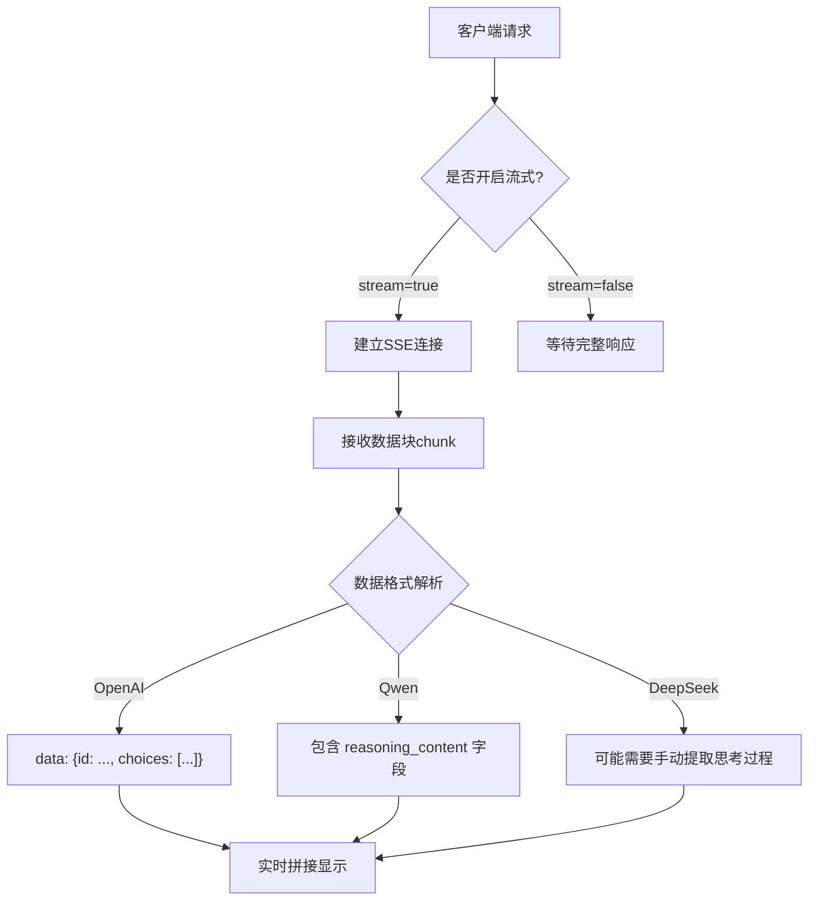
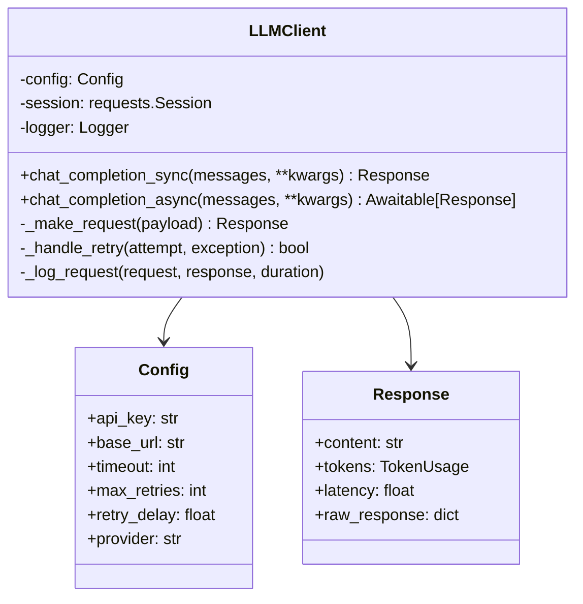
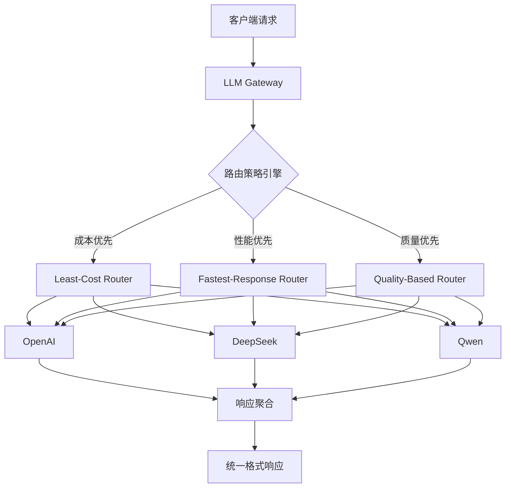

# LLM API 工程化封装最佳实践

## 前言
随着大语言模型（LLM）应用的爆发式增长，企业需要同时接入多个AI提供商（如OpenAI、DeepSeek、Qwen等）以满足不同场景需求。然而，直接调用原生API会导致代码耦合度高、供应商锁定、成本失控等问题。本文将从理论对比、代码实践、前沿趋势三个维度，系统讲解LLM API工程化封装的核心要点，帮助你构建高可用、低成本、易维护的AI服务层。

---

## 一、理论部分：主流LLM Provider API协议深度对比

### 1.1 协议兼容性概览

| 提供商 | API协议 | 兼容性 | 核心特点 |
|--------|---------|--------|----------|
| **OpenAI** | OpenAI原生格式 | 行业标准 | 完善的文档、稳定的SDK、全球节点 |
| **DeepSeek** | OpenAI兼容格式 | ⭐⭐⭐⭐⭐ | 完全兼容OpenAI SDK、国产模型成本优势 |
| **Qwen（通义千问）** | OpenAI兼容格式 | ⭐⭐⭐⭐⭐ | 原生支持推理过程、长文本处理强 |
| **Anthropic（Claude）** | Anthropic原生格式 | ⭐⭐ | 独特的思考链、需要专门适配 |

### 1.2 请求格式差异

#### OpenAI标准格式
```json
{
  "model": "gpt-3.5-turbo",
  "messages": [
    {"role": "system", "content": "你是一个助手"},
    {"role": "user", "content": "你好"}
  ],
  "temperature": 0.7,
  "max_tokens": 1000,
  "stream": false
}
```

#### DeepSeek特有参数
- `deep_think`: 启用深度思考模式（通过`extra_body`传递）
```python
extra_body={"deep_think": True}
```

#### Qwen特有参数
- `enable_thinking`: 启用推理过程
- 响应中包含`reasoning_content`字段

### 1.3 响应结构对比

| 字段 | OpenAI | DeepSeek | Qwen |
|------|--------|----------|------|
| `id` | ✅ | ✅ | ✅ |
| `choices[0].message.content` | ✅ | ✅ | ✅ |
| `choices[0].message.role` | ✅ | ✅ | ✅ |
| `usage.prompt_tokens` | ✅ | ✅ | ✅ |
| `usage.completion_tokens` | ✅ | ✅ | ✅ |
| `usage.total_tokens` | ✅ | ✅ | ✅ |
| `reasoning_content` | ❌ | ❌ | ✅ |
| `thinking_time` | ❌ | ❌ | ✅ |

### 1.4 流式支持差异



### 1.5 错误码设计对比

| 错误类型 | OpenAI | DeepSeek | Qwen |
|----------|--------|----------|------|
| 认证失败 | 401 | 401 | 401 |
| 权限不足 | 403 | 403 | 403 |
| 配额超限 | 429 | 429 | 429 |
| 服务器错误 | 500 | 500 | 500 |
| 模型不可用 | 503 | 503 | 503 |
| 输入过长 | 400 | 400 | 400 |

**关键差异**：
- OpenAI提供详细的错误信息字段（`code`, `param`, `type`）
- DeepSeek错误响应格式基本兼容OpenAI
- Qwen可能返回额外的业务错误码（如`BIZ_ERROR`）

---

## 二、代码实践：生产级LLM Client封装

### 2.1 设计目标
- **统一接口**：屏蔽不同Provider的API差异
- **高可用**：内置重试机制、熔断降级
- **可观测**：完整的日志记录、性能监控
- **成本可控**：Token用量统计、预算预警

### 2.2 核心架构



### 2.3 完整实现代码

```python
"""
生产级LLM Client封装
支持：OpenAI、DeepSeek、Qwen等兼容OpenAI API的提供商
特性：同步/异步调用、指数退避重试、请求日志、Token统计
"""

import os
import time
import json
import logging
from typing import Optional, Dict, Any, List, Union
from dataclasses import dataclass
from enum import Enum

import requests
from requests.adapters import HTTPAdapter
from urllib3.util.retry import Retry

# 异步支持（可选）
try:
    import aiohttp
    import asyncio
    ASYNC_AVAILABLE = True
except ImportError:
    ASYNC_AVAILABLE = False


class Provider(Enum):
    """支持的LLM提供商"""
    OPENAI = "openai"
    DEEPSEEK = "deepseek"
    QWEN = "qwen"
    CUSTOM = "custom"


@dataclass
class TokenUsage:
    """Token用量统计"""
    prompt_tokens: int = 0
    completion_tokens: int = 0
    total_tokens: int = 0
    
    @property
    def estimated_cost(self) -> float:
        """估算成本（基于通用费率）"""
        # OpenAI GPT-3.5 Turbo费率：$0.0005/1K input, $0.0015/1K output
        input_cost = (self.prompt_tokens / 1000) * 0.0005
        output_cost = (self.completion_tokens / 1000) * 0.0015
        return input_cost + output_cost


@dataclass
class LLMResponse:
    """标准化的LLM响应"""
    content: str
    tokens: TokenUsage
    latency: float  # 单位：秒
    raw_response: Optional[Dict] = None
    reasoning_content: Optional[str] = None  # Qwen特有


class LLMClient:
    """生产级LLM Client"""
    
    def __init__(
        self,
        api_key: Optional[str] = None,
        base_url: Optional[str] = None,
        provider: Provider = Provider.OPENAI,
        timeout: int = 30,
        max_retries: int = 3,
        retry_delay: float = 1.0,
        enable_logging: bool = True
    ):
        """
        初始化LLM Client
        
        Args:
            api_key: API密钥，如未提供则从环境变量读取
            base_url: API基础地址
            provider: 提供商类型
            timeout: 请求超时时间（秒）
            max_retries: 最大重试次数
            retry_delay: 重试延迟基数（秒）
            enable_logging: 是否启用日志
        """
        self.provider = provider
        
        # 配置管理
        self.api_key = api_key or os.getenv(f"{provider.value.upper()}_API_KEY")
        if not self.api_key:
            raise ValueError(f"API密钥未提供，请设置{provider.value.upper()}_API_KEY环境变量")
        
        self.base_url = base_url or self._get_default_base_url(provider)
        self.timeout = timeout
        self.max_retries = max_retries
        self.retry_delay = retry_delay
        
        # HTTP会话配置
        self.session = requests.Session()
        retry_strategy = Retry(
            total=max_retries,
            backoff_factor=retry_delay,
            status_forcelist=[429, 500, 502, 503, 504],
            allowed_methods=["POST"]
        )
        adapter = HTTPAdapter(max_retries=retry_strategy)
        self.session.mount("http://", adapter)
        self.session.mount("https://", adapter)
        
        # 日志配置
        self.logger = logging.getLogger(__name__)
        if enable_logging:
            self._setup_logging()
    
    def _get_default_base_url(self, provider: Provider) -> str:
        """获取默认API地址"""
        base_urls = {
            Provider.OPENAI: "https://api.openai.com/v1",
            Provider.DEEPSEEK: "https://api.deepseek.com/v1",
            Provider.QWEN: "https://dashscope.aliyuncs.com/api/v1",
        }
        return base_urls.get(provider, "https://api.openai.com/v1")
    
    def _setup_logging(self):
        """配置日志"""
        if not self.logger.handlers:
            handler = logging.StreamHandler()
            formatter = logging.Formatter(
                '%(asctime)s - %(name)s - %(levelname)s - %(message)s'
            )
            handler.setFormatter(formatter)
            self.logger.addHandler(handler)
            self.logger.setLevel(logging.INFO)
    
    def _build_request_headers(self) -> Dict[str, str]:
        """构建请求头"""
        headers = {
            "Content-Type": "application/json",
            "Accept": "application/json",
        }
        
        # 不同提供商的认证方式
        if self.provider == Provider.OPENAI:
            headers["Authorization"] = f"Bearer {self.api_key}"
        elif self.provider == Provider.DEEPSEEK:
            headers["Authorization"] = f"Bearer {self.api_key}"
        elif self.provider == Provider.QWEN:
            headers["Authorization"] = f"Bearer {self.api_key}"
        else:
            headers["Authorization"] = f"Bearer {self.api_key}"
        
        return headers
    
    def _build_request_payload(
        self,
        messages: List[Dict[str, str]],
        model: Optional[str] = None,
        temperature: float = 0.7,
        max_tokens: Optional[int] = None,
        stream: bool = False,
        **kwargs
    ) -> Dict[str, Any]:
        """构建请求体，处理不同提供商的参数差异"""
        
        # 默认模型
        if not model:
            model = self._get_default_model()
        
        payload = {
            "model": model,
            "messages": messages,
            "temperature": temperature,
            "stream": stream,
        }
        
        if max_tokens:
            payload["max_tokens"] = max_tokens
        
        # 提供商特有参数
        if self.provider == Provider.DEEPSEEK:
            # DeepSeek深度思考模式
            if kwargs.get("deep_think"):
                payload["extra_body"] = {"deep_think": True}
        
        elif self.provider == Provider.QWEN:
            # Qwen推理过程
            if kwargs.get("enable_thinking"):
                payload["enable_thinking"] = True
        
        # 保留其他参数
        for key, value in kwargs.items():
            if key not in payload and key not in ["deep_think", "enable_thinking"]:
                payload[key] = value
        
        return payload
    
    def _get_default_model(self) -> str:
        """获取默认模型名称"""
        models = {
            Provider.OPENAI: "gpt-3.5-turbo",
            Provider.DEEPSEEK: "deepseek-chat",
            Provider.QWEN: "qwen-turbo",
        }
        return models.get(self.provider, "gpt-3.5-turbo")
    
    def _parse_response(self, raw_response: Dict, latency: float) -> LLMResponse:
        """解析响应，统一格式"""
        
        # 提取内容
        if self.provider == Provider.QWEN:
            # Qwen可能返回reasoning_content
            reasoning_content = raw_response.get("choices", [{}])[0].get("message", {}).get("reasoning_content")
            content = raw_response.get("choices", [{}])[0].get("message", {}).get("content", "")
        else:
            reasoning_content = None
            content = raw_response.get("choices", [{}])[0].get("message", {}).get("content", "")
        
        # 提取Token用量
        usage_data = raw_response.get("usage", {})
        tokens = TokenUsage(
            prompt_tokens=usage_data.get("prompt_tokens", 0),
            completion_tokens=usage_data.get("completion_tokens", 0),
            total_tokens=usage_data.get("total_tokens", 0)
        )
        
        return LLMResponse(
            content=content,
            tokens=tokens,
            latency=latency,
            raw_response=raw_response,
            reasoning_content=reasoning_content
        )
    
    def _log_request(self, payload: Dict, response: LLMResponse, error: Optional[str] = None):
        """记录请求日志"""
        log_data = {
            "provider": self.provider.value,
            "model": payload.get("model"),
            "prompt_tokens": response.tokens.prompt_tokens,
            "completion_tokens": response.tokens.completion_tokens,
            "total_tokens": response.tokens.total_tokens,
            "latency": round(response.latency, 3),
            "estimated_cost": round(response.tokens.estimated_cost, 6),
            "error": error
        }
        
        if error:
            self.logger.error(f"LLM Request Failed: {json.dumps(log_data, ensure_ascii=False)}")
        else:
            self.logger.info(f"LLM Request: {json.dumps(log_data, ensure_ascii=False)}")
    
    def chat_completion_sync(
        self,
        messages: List[Dict[str, str]],
        model: Optional[str] = None,
        temperature: float = 0.7,
        max_tokens: Optional[int] = None,
        **kwargs
    ) -> LLMResponse:
        """
        同步聊天补全
        
        Args:
            messages: 消息列表，格式 [{"role": "user", "content": "..."}]
            model: 模型名称
            temperature: 温度参数
            max_tokens: 最大生成Token数
            **kwargs: 其他参数（如deep_think, enable_thinking等）
        
        Returns:
            LLMResponse: 标准化的响应对象
        """
        start_time = time.time()
        
        # 构建请求
        payload = self._build_request_payload(
            messages=messages,
            model=model,
            temperature=temperature,
            max_tokens=max_tokens,
            stream=False,
            **kwargs
        )
        
        headers = self._build_request_headers()
        
        try:
            # 发送请求
            resp = self.session.post(
                f"{self.base_url}/chat/completions",
                json=payload,
                headers=headers,
                timeout=self.timeout
            )
            resp.raise_for_status()
            
            # 解析响应
            response_data = resp.json()
            latency = time.time() - start_time
            response = self._parse_response(response_data, latency)
            
            # 记录日志
            self._log_request(payload, response)
            
            return response
            
        except requests.exceptions.RequestException as e:
            latency = time.time() - start_time
            error_response = LLMResponse(
                content="",
                tokens=TokenUsage(),
                latency=latency
            )
            self._log_request(payload, error_response, error=str(e))
            raise
    
    async def chat_completion_async(
        self,
        messages: List[Dict[str, str]],
        model: Optional[str] = None,
        temperature: float = 0.7,
        max_tokens: Optional[int] = None,
        **kwargs
    ) -> LLMResponse:
        """
        异步聊天补全（需要aiohttp）
        """
        if not ASYNC_AVAILABLE:
            raise RuntimeError("异步功能需要安装aiohttp: pip install aiohttp")
        
        start_time = time.time()
        
        # 构建请求
        payload = self._build_request_payload(
            messages=messages,
            model=model,
            temperature=temperature,
            max_tokens=max_tokens,
            stream=False,
            **kwargs
        )
        
        headers = self._build_request_headers()
        
        try:
            async with aiohttp.ClientSession() as session:
                async with session.post(
                    f"{self.base_url}/chat/completions",
                    json=payload,
                    headers=headers,
                    timeout=aiohttp.ClientTimeout(total=self.timeout)
                ) as resp:
                    resp.raise_for_status()
                    response_data = await resp.json()
                    
                    latency = time.time() - start_time
                    response = self._parse_response(response_data, latency)
                    
                    self._log_request(payload, response)
                    
                    return response
        
        except Exception as e:
            latency = time.time() - start_time
            error_response = LLMResponse(
                content="",
                tokens=TokenUsage(),
                latency=latency
            )
            self._log_request(payload, error_response, error=str(e))
            raise


# 使用示例
def demo_usage():
    """使用示例"""
    
    # 初始化不同提供商的Client
    openai_client = LLMClient(
        api_key=os.getenv("OPENAI_API_KEY"),
        provider=Provider.OPENAI
    )
    
    deepseek_client = LLMClient(
        api_key=os.getenv("DEEPSEEK_API_KEY"),
        provider=Provider.DEEPSEEK
    )
    
    qwen_client = LLMClient(
        api_key=os.getenv("QWEN_API_KEY"),
        provider=Provider.QWEN
    )
    
    # 构建消息
    messages = [
        {"role": "system", "content": "你是一个编程助手"},
        {"role": "user", "content": "用Python实现快速排序"}
    ]
    
    # 同步调用
    try:
        response = openai_client.chat_completion_sync(
            messages=messages,
            temperature=0.5,
            max_tokens=500
        )
        print(f"响应内容: {response.content[:100]}...")
        print(f"Token用量: {response.tokens.total_tokens}")
        print(f"延迟: {response.latency:.2f}秒")
        print(f"估算成本: ${response.tokens.estimated_cost:.6f}")
    
    except Exception as e:
        print(f"请求失败: {e}")
    
    # 异步调用示例（需要asyncio）
    async def async_demo():
        response = await qwen_client.chat_completion_async(
            messages=messages,
            enable_thinking=True
        )
        print(f"推理过程: {response.reasoning_content}")


if __name__ == "__main__":
    demo_usage()
```

### 2.4 关键设计要点

1. **统一接口设计**：所有Provider返回相同的`LLMResponse`对象
2. **弹性重试策略**：指数退避 + 状态码识别（429/5xx）
3. **提供商适配层**：通过`_build_request_payload`方法处理参数差异
4. **完整可观测性**：请求日志包含Token用量、延迟、估算成本
5. **异步支持**：基于aiohttp的异步实现（可选）

### 2.5 测试用例

```python
import pytest
from unittest.mock import Mock, patch
from llm_client import LLMClient, Provider

def test_openai_sync_call():
    """测试OpenAI同步调用"""
    client = LLMClient(api_key="test-key", provider=Provider.OPENAI)
    
    with patch.object(client.session, 'post') as mock_post:
        mock_response = Mock()
        mock_response.json.return_value = {
            "choices": [{"message": {"content": "Hello"}}],
            "usage": {"prompt_tokens": 10, "completion_tokens": 5, "total_tokens": 15}
        }
        mock_response.raise_for_status.return_value = None
        mock_post.return_value = mock_response
        
        response = client.chat_completion_sync([{"role": "user", "content": "Hi"}])
        
        assert response.content == "Hello"
        assert response.tokens.total_tokens == 15
```

---

## 三、前沿知识模块：2025-2026年LLM API工程化趋势

### 3.1 多Provider动态路由架构



**核心组件**：
- **策略引擎**：根据请求特征选择最优路由策略
- **健康检查**：实时监控各Provider可用性和延迟
- **负载均衡**：基于权重、成本、性能的智能分发
- **故障转移**：自动切换到备用Provider

### 3.2 基于Token的精准限流

| 限流维度 | 实现方案 | 适用场景 |
|----------|----------|----------|
| **QPS限流** | 固定窗口/滑动窗口 | API基础防护 |
| **Token限流** | 基于消耗估算 | 成本控制 |
| **预算限流** | 实时预算监控 | 财务管控 |
| **并发限流** | 信号量机制 | 资源保护 |

**Token限流算法**：
```python
class TokenRateLimiter:
    """基于Token消耗的限流器"""
    
    def __init__(self, daily_budget: float, token_cost_per_1k: dict):
        """
        Args:
            daily_budget: 日预算（美元）
            token_cost_per_1k: 每千Token成本 {provider: cost}
        """
        self.daily_budget = daily_budget
        self.token_cost = token_cost_per_1k
        self.daily_consumption = 0
        
    def can_make_request(self, estimated_tokens: int, provider: str) -> bool:
        """检查是否允许请求"""
        estimated_cost = (estimated_tokens / 1000) * self.token_cost.get(provider, 0.001)
        
        # 检查预算
        if self.daily_consumption + estimated_cost > self.daily_budget:
            return False
        
        # 更新消耗（实际消耗应在响应后更新）
        self.daily_consumption += estimated_cost
        return True
```

### 3.3 成本监控与优化策略

**三级成本优化体系**：

1. **实时监控层**：
   - Token用量实时统计
   - 成本按Provider/项目/用户维度拆分
   - 预算预警（80%/90%/100%阈值）

2. **智能优化层**：
   - **模型选择优化**：根据任务类型自动选择成本效益最优模型
   - **缓存策略**：语义缓存 + 结果缓存，减少重复调用
   - **请求合并**：批量处理相似请求，降低Token开销

3. **财务管控层**：
   - 月度/季度预算分配
   - 成本归因分析（ROI计算）
   - 异常消费检测（防滥用）

### 3.4 企业级AI网关技术栈

| 组件 | 推荐方案 | 核心特性 |
|------|----------|----------|
| **统一网关** | LiteLLM / APISIX AI Gateway | 多Provider路由、协议转换 |
| **监控告警** | Prometheus + Grafana | 实时指标监控、自定义告警 |
| **日志系统** | ELK Stack / Loki | 结构化日志、链路追踪 |
| **缓存层** | Redis / Memcached | 语义缓存、结果复用 |
| **安全防护** | OPA（Open Policy Agent） | 细粒度权限控制、审计日志 |

### 3.5 未来趋势预测

1. **标准化协议演进**：
   - OpenAI API成为事实标准
   - 更多Provider提供兼容模式
   - 行业标准组织介入制定规范

2. **边缘AI集成**：
   - 本地模型与云端API混合部署
   - 基于网络质量的智能路由
   - 离线优先的设计模式

3. **智能成本控制**：
   - AI驱动的成本预测与优化
   - 动态定价模型（基于供需）
   - 企业级预算管理系统

---

## 四、每日测验

### 4.1 选择题

**1. 关于LLM API协议兼容性，以下说法正确的是：**
A) DeepSeek使用Anthropic原生API格式，需要专门适配
B) Qwen完全不兼容OpenAI API，必须使用专用SDK
C) DeepSeek和Qwen都提供OpenAI兼容模式，迁移成本低
D) 所有国产模型都使用完全相同的API协议

**2. 在生产级LLM Client中实现重试机制时，最佳实践不包括：**
A) 对5xx错误使用指数退避重试
B) 对429错误立即重试，无需延迟
C) 设置最大重试次数，避免无限循环
D) 记录每次重试的详细信息，便于排查

**3. 基于Token的精准限流与传统的QPS限流相比，主要优势在于：**
A) 实现更简单，资源消耗更低
B) 能更精确地控制API调用成本
C) 对突发流量的处理能力更强
D) 完全不需要依赖外部存储

**4. 在处理多Provider动态路由时，以下哪种策略最适合成本敏感型应用？**
A) Round-Robin（轮询）
B) Least-Cost（最低成本）
C) Fastest-Response（最快响应）
D) Quality-Based（质量优先）

**5. 关于LLM API错误处理，以下做法不推荐的是：**
A) 对不同Provider的错误响应进行统一格式化
B) 记录完整的错误信息，包括请求ID和时间戳
C) 在用户界面直接显示原始错误堆栈信息
D) 对临时性错误（如网络超时）实现自动重试

### 4.2 答案解析

**1. C** - DeepSeek和Qwen都提供OpenAI兼容模式，这意味着可以使用相同的SDK和代码结构进行调用，迁移成本低。

**2. B** - 对429错误（速率限制）不应该立即重试，而应该采用指数退避策略，或者根据响应头中的`Retry-After`信息延迟重试。

**3. B** - Token限流的核心优势是能够基于实际消耗（Token数量）进行精准控制，直接关联到API调用成本，而QPS限流无法反映不同请求的实际资源消耗差异。

**4. B** - 对于成本敏感型应用，Least-Cost（最低成本）策略会自动选择当前最便宜的Provider，最大化成本效益。

**5. C** - 在用户界面直接显示原始错误堆栈信息会暴露系统内部细节，存在安全风险，也不利于用户体验。应该对错误信息进行友好化处理。

---

## 五、学习总结

通过本文的学习，你应该掌握：

1. **理论深度**：理解OpenAI、DeepSeek、Qwen等主流Provider的API协议差异
2. **工程实践**：能够实现生产级的LLM Client封装，包含重试、日志、监控等企业级特性
3. **前沿视野**：了解多Provider动态路由、Token限流、成本监控等最新趋势
4. **应用能力**：能够根据业务需求选择合适的Provider和技术方案

**下一步行动建议**：
1. 运行本文提供的代码示例，熟悉LLM Client的调用方式
2. 尝试扩展代码，添加熔断降级、请求合并等高级特性
3. 调研LiteLLM、APISIX AI Gateway等开源方案，了解其实现原理
4. 设计一个小型项目，实践多Provider动态路由和成本监控

---

**版权声明**：本文为AI Agent工程师学习计划Day 5课程内容，仅供参考学习。转载请注明出处。