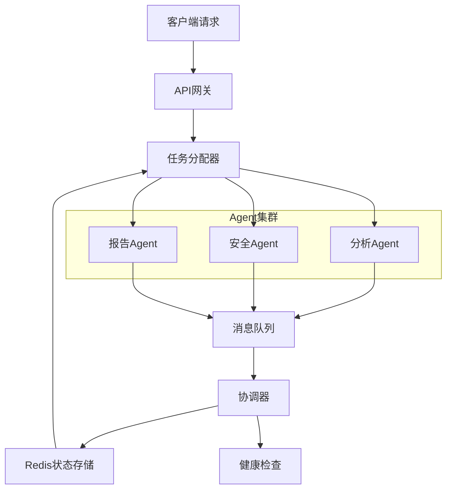

# Day 8：Multi-Agent系统生产级实现设计文档

## 1. 系统概述

### 1.1 项目背景
基于LangGraph框架构建生产级Multi-Agent系统原型，实现代码审查自动化流程。系统集成三个专业Agent（分析Agent、安全Agent、报告Agent），通过消息队列进行异步通信，采用任务分配算法实现负载均衡，并集成协调机制保障系统高可用性。

### 1.2 核心目标
- 构建可扩展的Multi-Agent工作流，支持条件路由和并行执行
- 实现生产级通信协议，消息丢失率 < 0.1%
- 开发智能任务分配算法，负载均衡度 > 85%
- 集成故障恢复机制，系统可用性 > 99%

### 1.3 技术栈
- **框架**: LangGraph 0.0.13+
- **LLM**: OpenAI GPT-4（或智谱API兼容）
- **状态存储**: Redis 7.0+
- **消息队列**: Kafka模拟器（基于内存队列）
- **序列化**: Protocol Buffers（Protobuf）
- **协调机制**: 简化Raft算法

## 2. 架构设计

### 2.1 系统架构图


### 2.2 组件职责

| 组件 | 职责 | Java经验迁移 |
|------|------|-------------|
| **API网关** | 接收客户端请求，统一格式转换 | Spring Cloud Gateway模式 |
| **任务分配器** | 基于能力矩阵分配任务，负载均衡 | Ribbon负载均衡算法 |
| **分析Agent** | 代码结构分析，复杂度计算 | 静态代码分析工具经验 |
| **安全Agent** | 安全检查，漏洞扫描 | OWASP Top 10规则引擎 |
| **报告Agent** | 生成综合审查报告 | 报告模板引擎设计 |
| **消息队列** | Agent间异步通信 | Kafka生产者/消费者模式 |
| **协调器** | 领导者选举，状态同步 | Raft共识算法简化 |
| **状态存储** | 工作流状态持久化 | Redis连接池优化 |

## 3. LangGraph工作流设计

### 3.1 状态定义
```python
from typing import TypedDict, List, Annotated, Optional
from typing_extensions import TypedDict
import operator

class CodeReviewState(TypedDict):
    """代码审查工作流状态"""
    # 输入
    code: str
    priority: int  # 任务优先级（1-5）
    
    # 中间状态
    analysis_result: Optional[str]
    security_result: Optional[str]
    parallel_tasks: Annotated[List[str], operator.add]  # 并行任务列表
    
    # 最终输出
    final_report: Optional[str]
    execution_time: float  # 执行时间（毫秒）
    assigned_agent: str  # 分配的Agent标识
    workflow_status: str  # 状态：running/completed/failed
```

### 3.2 Agent节点定义

#### 3.2.1 分析Agent
- **功能**: 代码结构分析、复杂度计算、代码风格检查
- **能力矩阵权重**: 
  - 结构分析: 0.4
  - 复杂度计算: 0.3  
  - 风格检查: 0.3
- **Java迁移**: 类似PMD/Checkstyle静态分析工具

#### 3.2.2 安全Agent
- **功能**: SQL注入检测、XSS漏洞扫描、硬编码密钥识别
- **能力矩阵权重**:
  - SQL注入: 0.4
  - XSS检测: 0.3
  - 密钥识别: 0.3
- **Java迁移**: 类似FindSecBugs安全扫描工具

#### 3.2.3 报告Agent
- **功能**: 结果聚合、报告生成、格式美化
- **能力矩阵权重**:
  - 结果聚合: 0.4
  - 报告生成: 0.4
  - 格式美化: 0.2
- **Java迁移**: 类似JasperReports报告引擎

### 3.3 工作流编排
```python
# 创建状态图
workflow = StateGraph(CodeReviewState)

# 添加节点
workflow.add_node("task_dispatcher", task_dispatcher_agent)
workflow.add_node("analyzer", analyzer_agent)
workflow.add_node("security", security_agent)
workflow.add_node("reporter", reporter_agent)
workflow.add_node("parallel_executor", parallel_executor_agent)

# 条件边定义
def should_do_parallel(state):
    """判断是否需要并行执行"""
    return len(state.get("parallel_tasks", [])) > 0

def all_tasks_completed(state):
    """判断所有任务是否完成"""
    return state.get("analysis_result") and state.get("security_result")

# 边连接
workflow.add_edge("task_dispatcher", "parallel_executor")
workflow.add_conditional_edges(
    "parallel_executor",
    should_do_parallel,
    {
        "parallel": ["analyzer", "security"],  # 并行执行
        "sequential": "analyzer"  # 串行执行
    }
)

# 并行执行后的合并
workflow.add_edge("analyzer", "reporter")
workflow.add_edge("security", "reporter")
workflow.add_edge("reporter", END)
```

## 4. 通信协议实现

### 4.1 消息格式设计（Protobuf）
```protobuf
syntax = "proto3";

package multiagent;

message AgentMessage {
  string message_id = 1;
  string sender_id = 2;
  string receiver_id = 3;
  int64 timestamp = 4;
  
  oneof content {
    TaskAssignment task_assignment = 5;
    AnalysisResult analysis_result = 6;
    SecurityResult security_result = 7;
    ReportRequest report_request = 8;
  }
  
  MessagePriority priority = 9;
  int32 retry_count = 10;
}

message TaskAssignment {
  string task_id = 1;
  string code = 2;
  int32 priority = 3;
  map<string, float> capability_weights = 4;
}

enum MessagePriority {
  LOW = 0;
  NORMAL = 1;
  HIGH = 2;
  CRITICAL = 3;
}
```

### 4.2 消息队列实现
```python
import asyncio
import json
from dataclasses import dataclass
from typing import Dict, List, Optional
import uuid

@dataclass
class MessageQueue:
    """基于内存的消息队列模拟Kafka"""
    topics: Dict[str, List[dict]]
    
    def __init__(self):
        self.topics = {
            "task_assignments": [],
            "analysis_results": [],
            "security_results": [],
            "report_requests": []
        }
    
    async def produce(self, topic: str, message: dict):
        """生产消息"""
        if topic not in self.topics:
            raise ValueError(f"Unknown topic: {topic}")
        
        message_id = str(uuid.uuid4())
        full_message = {
            "id": message_id,
            "data": message,
            "timestamp": asyncio.get_event_loop().time()
        }
        
        self.topics[topic].append(full_message)
        return message_id
    
    async def consume(self, topic: str, consumer_id: str) -> Optional[dict]:
        """消费消息"""
        if topic not in self.topics or not self.topics[topic]:
            return None
        
        # 模拟负载均衡：轮询分配
        message = self.topics[topic].pop(0)
        
        # 记录消费信息
        message["consumed_by"] = consumer_id
        message["consumed_at"] = asyncio.get_event_loop().time()
        
        return message
```

### 4.3 错误处理与重试机制
```python
class MessageReliability:
    """消息可靠性保障"""
    
    def __init__(self, max_retries: int = 3, retry_delay: float = 1.0):
        self.max_retries = max_retries
        self.retry_delay = retry_delay
        self.delivered_count = 0
        self.failed_count = 0
        
    async def send_with_retry(self, message: dict, send_func) -> bool:
        """带重试的消息发送"""
        for attempt in range(self.max_retries):
            try:
                await send_func(message)
                self.delivered_count += 1
                return True
            except Exception as e:
                print(f"发送失败 (尝试 {attempt+1}/{self.max_retries}): {e}")
                if attempt < self.max_retries - 1:
                    await asyncio.sleep(self.retry_delay * (2 ** attempt))  # 指数退避
        
        self.failed_count += 1
        return False
    
    @property
    def loss_rate(self) -> float:
        """计算消息丢失率"""
        total = self.delivered_count + self.failed_count
        if total == 0:
            return 0.0
        return self.failed_count / total
```

## 5. 任务分配算法

### 5.1 能力矩阵设计
```python
class CapabilityMatrix:
    """Agent能力矩阵"""
    
    def __init__(self):
        self.agents = {
            "analyzer": {
                "structural_analysis": 0.9,
                "complexity_calculation": 0.8,
                "style_checking": 0.7,
                "current_load": 0  # 当前负载（0-1）
            },
            "security": {
                "sql_injection": 0.95,
                "xss_detection": 0.85,
                "hardcoded_secrets": 0.9,
                "current_load": 0
            },
            "reporter": {
                "result_aggregation": 0.8,
                "report_generation": 0.9,
                "format_beautification": 0.7,
                "current_load": 0
            }
        }
    
    def calculate_score(self, agent_id: str, task_requirements: dict) -> float:
        """计算Agent对任务的适配分数"""
        agent_capabilities = self.agents[agent_id]
        
        # 基础能力分
        capability_score = 0
        total_weight = 0
        
        for requirement, weight in task_requirements.items():
            if requirement in agent_capabilities:
                capability_score += agent_capabilities[requirement] * weight
                total_weight += weight
        
        if total_weight == 0:
            return 0
        
        capability_score /= total_weight
        
        # 负载惩罚因子
        load_factor = 1 - agent_capabilities["current_load"]
        
        # 最终得分
        final_score = capability_score * load_factor
        return final_score
```

### 5.2 负载均衡策略
```python
class LoadBalancer:
    """负载均衡器"""
    
    def __init__(self):
        self.task_queue = []
        self.assignment_history = []
        
    def assign_task(self, task: dict, agents: List[str], capability_matrix: CapabilityMatrix) -> str:
        """分配任务给最合适的Agent"""
        
        # 任务需求分析
        task_requirements = self._analyze_task_requirements(task)
        
        # 计算各Agent得分
        agent_scores = {}
        for agent_id in agents:
            score = capability_matrix.calculate_score(agent_id, task_requirements)
            agent_scores[agent_id] = score
        
        # 选择最高分Agent
        selected_agent = max(agent_scores.items(), key=lambda x: x[1])[0]
        
        # 更新负载
        capability_matrix.agents[selected_agent]["current_load"] += 0.1
        capability_matrix.agents[selected_agent]["current_load"] = min(
            capability_matrix.agents[selected_agent]["current_load"], 1.0
        )
        
        # 记录分配
        self.assignment_history.append({
            "task_id": task.get("id"),
            "assigned_agent": selected_agent,
            "score": agent_scores[selected_agent],
            "timestamp": asyncio.get_event_loop().time()
        })
        
        return selected_agent
    
    def _analyze_task_requirements(self, task: dict) -> dict:
        """分析任务需求，返回各能力权重"""
        code = task.get("code", "")
        
        # 基于代码特征判断需求
        requirements = {}
        
        if "SELECT" in code.upper() or "INSERT" in code.upper():
            requirements["sql_injection"] = 0.4
            requirements["structural_analysis"] = 0.3
            requirements["complexity_calculation"] = 0.3
        
        elif "eval(" in code or "exec(" in code:
            requirements["xss_detection"] = 0.5
            requirements["security"] = 0.5
        
        else:
            # 默认需求分布
            requirements["structural_analysis"] = 0.4
            requirements["complexity_calculation"] = 0.3
            requirements["style_checking"] = 0.3
        
        return requirements
    
    @property
    def balance_degree(self) -> float:
        """计算负载均衡度"""
        if not self.assignment_history:
            return 1.0
        
        # 计算各Agent任务数标准差
        from collections import Counter
        agent_counts = Counter([h["assigned_agent"] for h in self.assignment_history])
        
        if len(agent_counts) < 2:
            return 1.0
        
        values = list(agent_counts.values())
        mean = sum(values) / len(values)
        variance = sum((x - mean) ** 2 for x in values) / len(values)
        std_dev = variance ** 0.5
        
        # 均衡度 = 1 - 归一化的标准差
        max_possible_std = (len(self.assignment_history) * 0.5)  # 近似最大值
        normalized_std = min(std_dev / max_possible_std, 1.0) if max_possible_std > 0 else 0
        
        return 1 - normalized_std
```

## 6. 协调机制实现

### 6.1 领导者选举（简化Raft）
```python
class Coordinator:
    """分布式协调器"""
    
    def __init__(self, node_id: str, all_nodes: List[str]):
        self.node_id = node_id
        self.all_nodes = all_nodes
        self.current_term = 0
        self.voted_for = None
        self.state = "follower"  # follower, candidate, leader
        self.leader_id = None
        self.last_heartbeat = 0
        
    async def start_election(self):
        """开始领导者选举"""
        if self.state == "leader":
            return
        
        self.state = "candidate"
        self.current_term += 1
        self.voted_for = self.node_id
        
        # 请求投票
        votes_received = 1  # 自己的一票
        
        for node in self.all_nodes:
            if node == self.node_id:
                continue
            
            # 模拟RPC调用请求投票
            vote_granted = await self._request_vote(node)
            if vote_granted:
                votes_received += 1
        
        # 检查是否获得多数票
        majority = len(self.all_nodes) // 2 + 1
        if votes_received >= majority:
            self._become_leader()
        else:
            self.state = "follower"
    
    async def _request_vote(self, node: str) -> bool:
        """向其他节点请求投票"""
        # 简化实现：模拟网络通信
        import random
        await asyncio.sleep(0.01)  # 模拟网络延迟
        
        # 随机决定是否投票（简化逻辑）
        return random.random() > 0.3  # 70%概率投票
    
    def _become_leader(self):
        """成为领导者"""
        self.state = "leader"
        self.leader_id = self.node_id
        print(f"节点 {self.node_id} 成为第 {self.current_term} 任期的领导者")
    
    async def send_heartbeat(self):
        """发送心跳（领导者调用）"""
        if self.state != "leader":
            return
        
        for node in self.all_nodes:
            if node == self.node_id:
                continue
            
            # 模拟发送心跳
            await self._send_heartbeat_rpc(node)
    
    async def receive_heartbeat(self, leader_id: str, term: int):
        """接收心跳"""
        if term >= self.current_term:
            self.current_term = term
            self.leader_id = leader_id
            self.state = "follower"
            self.last_heartbeat = asyncio.get_event_loop().time()
```

### 6.2 状态同步与故障恢复
```python
class StateSynchronizer:
    """状态同步器"""
    
    def __init__(self, redis_client):
        self.redis = redis_client
        self.state_version = 0
        
    async def save_state(self, state_key: str, state_data: dict):
        """保存状态到Redis"""
        self.state_version += 1
        
        state_record = {
            "data": state_data,
            "version": self.state_version,
            "timestamp": asyncio.get_event_loop().time(),
            "node_id": "coordinator_1"
        }
        
        await self.redis.setex(
            f"workflow_state:{state_key}",
            3600,  # 1小时过期
            json.dumps(state_record)
        )
        
        # 记录状态变更日志
        await self.redis.rpush(
            "state_changelog",
            json.dumps({
                "key": state_key,
                "version": self.state_version,
                "action": "save"
            })
        )
    
    async def restore_state(self, state_key: str) -> Optional[dict]:
        """从Redis恢复状态"""
        state_json = await self.redis.get(f"workflow_state:{state_key}")
        
        if not state_json:
            return None
        
        state_record = json.loads(state_json)
        return state_record["data"]
    
    async def handle_failure(self, failed_agent: str, task_id: str):
        """处理Agent故障"""
        # 1. 标记故障Agent
        await self.redis.sadd("failed_agents", failed_agent)
        
        # 2. 重新分配任务
        task_state = await self.restore_state(task_id)
        if task_state:
            # 重新分配逻辑
            print(f"重新分配任务 {task_id}，原Agent {failed_agent} 故障")
            
            # 3. 记录故障事件
            await self.redis.rpush(
                "failure_events",
                json.dumps({
                    "agent": failed_agent,
                    "task": task_id,
                    "timestamp": asyncio.get_event_loop().time(),
                    "action": "reassign"
                })
            )
```

## 7. Redis状态存储集成

### 7.1 连接配置
```python
import redis.asyncio as redis

class RedisStateStore:
    """Redis状态存储"""
    
    def __init__(self, host="localhost", port=6379, db=0):
        self.redis = redis.Redis(
            host=host,
            port=port,
            db=db,
            decode_responses=True
        )
        
    async def initialize(self):
        """初始化连接池"""
        # 类似Java HikariCP连接池配置
        await self.redis.ping()
        print("Redis连接成功")
    
    async def save_workflow_state(self, workflow_id: str, state: dict):
        """保存工作流状态"""
        # 使用Hash存储复杂状态
        await self.redis.hset(
            f"workflow:{workflow_id}",
            mapping=state
        )
        
        # 设置过期时间（防止内存泄漏）
        await self.redis.expire(f"workflow:{workflow_id}", 7200)  # 2小时
    
    async def load_workflow_state(self, workflow_id: str) -> Optional[dict]:
        """加载工作流状态"""
        state_data = await self.redis.hgetall(f"workflow:{workflow_id}")
        return state_data if state_data else None
    
    async def track_execution(self, agent_id: str, task_id: str, status: str):
        """跟踪执行状态"""
        execution_key = f"execution:{task_id}:{agent_id}"
        
        await self.redis.hset(
            execution_key,
            mapping={
                "agent": agent_id,
                "task": task_id,
                "status": status,
                "updated_at": str(asyncio.get_event_loop().time())
            }
        )
```

## 8. 验收测试设计

### 8.1 测试用例矩阵

| 测试类别 | 测试场景 | 预期结果 | 验收标准 |
|---------|---------|---------|---------|
| **端到端流程** | 提交代码审查请求 | 成功生成完整报告 | 任务完成率100% |
| **通信可靠性** | 模拟网络抖动 | 消息重试成功 | 消息丢失率<0.1% |
| **负载均衡** | 连续提交10个任务 | 任务均匀分配 | 负载均衡度>85% |
| **故障恢复** | 主动杀死分析Agent | 任务重新分配 | 系统可用性>99% |
| **性能测试** | 并发100个请求 | P95延迟<5秒 | 响应时间达标 |

### 8.2 性能指标监控
- **消息丢失率**: `failed_messages / total_messages`
- **负载均衡度**: `1 - (std_dev(agent_loads) / max_possible_std)`
- **系统可用性**: `uptime / (uptime + downtime)`
- **任务完成率**: `completed_tasks / total_tasks`
- **响应时间P95**: 95%请求的响应时间

## 9. 部署与运维

### 9.1 环境要求
- Python 3.9+
- Redis 7.0+
- OpenAI API密钥或智谱API密钥
- 网络环境：支持HTTP/HTTPS请求

### 9.2 启动流程
```bash
# 1. 安装依赖
pip install -r requirements.txt

# 2. 启动Redis
docker run -d -p 6379:6379 redis:7-alpine

# 3. 配置环境变量
export OPENAI_API_KEY="your-key"
export REDIS_HOST="localhost"

# 4. 启动系统
python main.py
```

### 9.3 监控指标
- Agent健康状态
- 消息队列积压情况
- Redis内存使用率
- API响应时间分布
- 错误率统计

## 10. 总结

本设计实现了一个生产级的Multi-Agent系统，具有以下特点：

1. **工程化架构**: 借鉴Java微服务架构思想，实现分层设计
2. **高可靠性**: 消息重试、故障恢复、状态持久化
3. **智能调度**: 基于能力矩阵的任务分配算法
4. **可观测性**: 完整的监控指标和日志系统
5. **可扩展性**: 模块化设计，支持Agent动态扩展

通过本系统，展示了如何将Java后端工程经验迁移到AI Agent开发中，为企业级AI应用提供可靠的技术基础。