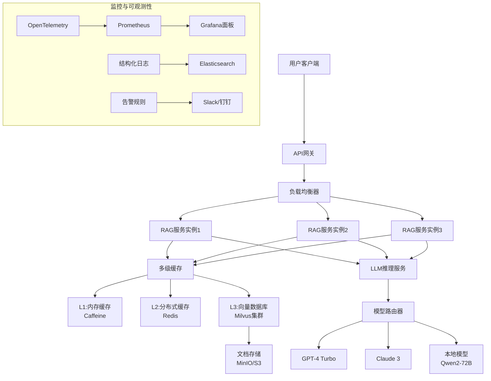

# Day 9：AI应用生产级架构设计深度解析

## 学习目标
- 深入理解传统架构与AI架构的核心差异
- 掌握三种主流AI应用架构模式的生产级实现
- 学习企业级AI应用的关键考量因素
- 完成Java后端经验向AI工程架构的迁移

## 1. 传统架构 vs AI架构深度对比

### 确定性 vs 概率性：工程范式的根本转变

| 维度 | 传统应用架构 | AI应用架构 | 生产级影响 |
|------|-------------|------------|------------|
| **核心逻辑** | 硬编码规则、确定性算法 | 概率推理、模型输出不确定性 | 需要错误边界处理、置信度评估、降级策略 |
| **数据处理** | 结构化数据为主（JSON/DB表） | 非结构化数据为主（文本/图像/语音） | 引入向量化流水线、多模态处理、存储成本飙升 |
| **延迟要求** | 毫秒级（P95 < 100ms） | 秒级可接受（P95 < 2-5秒） | 异步处理成为常态、流式响应、队列缓冲设计 |
| **可预测性** | 确定性输出、可重复验证 | 不确定性输出、每次可能不同 | 需A/B测试框架、输出质量监控、人工复核流程 |
| **故障模式** | 代码bug、服务宕机、网络超时 | 模型幻觉、上下文溢出、Token超限、API限流 | 复杂故障树、需要多层降级、成本熔断机制 |
| **部署单元** | 微服务、容器、无状态实例 | 模型服务、向量数据库、Agent编排引擎 | GPU资源管理、模型版本控制、推理服务扩缩容 |

### AI架构新挑战与生产级应对策略

#### 挑战1：模型输出的不可预测性
- **问题**：LLM可能产生幻觉、编造事实、逻辑错误
- **生产级策略**：
  - 实现三级置信度评估（低/中/高）
  - 低置信度结果触发人工复核或精确检索降级
  - 构建事实核查链（Fact-Checking Chain）

#### 挑战2：LLM推理的高延迟
- **问题**：GPT-4单次推理可达2-10秒，影响用户体验
- **生产级策略**：
  - 流式输出（token-by-token）隐藏延迟
  - 预测性缓存（基于会话历史的预生成）
  - 边缘部署轻量模型（如TinyLLM）处理简单查询

#### 挑战3：Token消耗的成本控制
- **问题**：API调用成本随Token数量线性增长
- **生产级策略**：
  - 实时Token计数与预算预警（类似熔断器）
  - 上下文压缩算法（关键信息提取、记忆蒸馏）
  - 请求路由优化（简单查询→廉价模型，复杂查询→优质模型）

#### 挑战4：数据隐私与合规性
- **问题**：用户数据可能包含PII、商业机密
- **生产级策略**：
  - 本地化模型部署（避免数据出境）
  - 敏感信息脱敏引擎（正则+NER双重检测）
  - 审计日志全链路追踪（Who/What/When/Where）

## 2. AI应用架构模式深化

### 模式1：企业级RAG架构（生产级优化）

#### 架构图


#### 核心组件设计

**1. 多级缓存策略（生产级性能优化）**
```python
# 伪代码示例：三级缓存实现
class MultiLevelCacheRAG:
    def __init__(self):
        self.l1_cache = LocalCache(maxsize=1000)  # 内存缓存，高频问题
        self.l2_cache = RedisCache(ttl=3600)      # 分布式缓存，会话级缓存
        self.l3_cache = VectorCache(milvus_client) # 向量缓存，语义相似缓存
    
    async def query(self, question: str, session_id: str) -> str:
        # L1: 完全匹配缓存（毫秒级）
        l1_key = f"exact:{hash(question)}"
        if cached := self.l1_cache.get(l1_key):
            return cached
        
        # L2: 会话缓存（秒级，相同会话内的相似问题）
        l2_key = f"session:{session_id}:{hash(question)}"
        if cached := self.l2_cache.get(l2_key):
            self.l1_cache.set(l1_key, cached)
            return cached
        
        # L3: 语义缓存（向量相似度匹配）
        similar_questions = self.l3_cache.find_similar(question, threshold=0.85)
        if similar_questions:
            best_answer = self.rank_answers(similar_questions)
            self.l1_cache.set(l1_key, best_answer)
            self.l2_cache.set(l2_key, best_answer)
            return best_answer
        
        # 未命中缓存，执行完整RAG流程
        answer = await self.execute_full_rag(question)
        
        # 更新所有缓存层
        self.l1_cache.set(l1_key, answer)
        self.l2_cache.set(l2_key, answer)
        self.l3_cache.add(question, answer)
        
        return answer
```

**2. 负载均衡与水平扩展设计**
- **智能路由**：基于问题复杂度路由到不同规格的实例
- **动态扩缩容**：基于QPS、Token消耗、GPU利用率自动调整
- **会话亲和性**：同一会话的请求路由到同一实例，保持上下文连贯

**3. 故障转移与降级机制**
- **三级降级链**：
  1. 精确检索模式（向量+关键词混合检索）
  2. 知识源降级（仅使用权威知识库，禁用开放生成）
  3. 模板化回复（预设FAQ匹配）
- **健康检查**：模型服务健康状态、API配额、响应延迟监控

### 模式2：Agent编排架构（企业级实现）

#### 分层架构设计

```
┌─────────────────────────────────────────────────────┐
│                  接入层                              │
│  ┌─────────────────────────────────────────────┐  │
│  │ API网关（认证/限流/路由）                    │  │
│  │ WebSocket（实时交互）                        │  │
│  └─────────────────────────────────────────────┘  │
└──────────────────────────┬──────────────────────────┘
                           ↓
┌─────────────────────────────────────────────────────┐
│                  编排层                              │
│  ┌─────────────────────────────────────────────┐  │
│  │ 任务分解引擎（ReAct/Chain-of-Thought）      │  │
│  │ 工具调度器（RBAC权限控制）                   │  │
│  │ 状态管理器（Redis持久化）                    │  │
│  └─────────────────────────────────────────────┘  │
└──────────────────────────┬──────────────────────────┘
                           ↓
┌─────────────────────────────────────────────────────┐
│                  执行层                              │
│  ┌─────────┐ ┌─────────┐ ┌─────────┐ ┌─────────┐  │
│  │ 工具A   │ │ 工具B   │ │ LLM推理 │ │ 记忆服务│  │
│  │ 代码执行│ │ 网络搜索│ │ 服务    │ │ 长期记忆│  │
│  └─────────┘ └─────────┘ └─────────┘ └─────────┘  │
└─────────────────────────────────────────────────────┘
```

#### 核心组件详解

**1. 任务分解引擎（基于Java工作流经验迁移）**
```python
# 伪代码：层次任务分解（类似Activiti工作流）
class HierarchicalTaskDecomposer:
    def __init__(self):
        self.llm = ChatOpenAI()
        self.state_machine = TaskStateMachine()
    
    async def decompose(self, goal: str) -> List[Task]:
        # 第一步：目标解析（类似Spring状态机）
        goal_type = self.classify_goal(goal)
        
        # 第二步：层次分解（类似BPMN流程分解）
        if goal_type == "CODE_REVIEW":
            return [
                Task("分析代码结构", "static_analyzer"),
                Task("检查安全漏洞", "security_scanner"),
                Task("生成审查报告", "report_generator")
            ]
        elif goal_type == "RESEARCH_TASK":
            return [
                Task("搜索相关信息", "web_search"),
                Task("整理关键点", "summarizer"),
                Task("生成研究报告", "report_writer")
            ]
        
        # 第三步：依赖关系构建（类似DAG调度器）
        tasks = self.build_dependency_graph(tasks)
        return tasks
```

**2. 工具调度器（RBAC权限控制引擎）**
- **权限模型**：角色（Role）→ 工具组（Tool Group）→ 具体工具（Tool）
- **动态策略**：基于Open Policy Agent（OPA）实现策略即代码
- **审计日志**：所有工具调用记录结构化存储，支持合规审计

**3. 状态管理器（Redis会话存储优化）**
- **分层存储**：
  - 短期记忆：Redis缓存（TTL: 30分钟）
  - 长期记忆：向量数据库（关键信息提取存储）
  - 工作记忆：当前会话上下文（滑动窗口，最大10轮）
- **Java经验迁移**：借鉴Spring Session的分布式会话管理

### 模式3：Multi-Agent分布式架构（大规模部署）

#### 分布式协作架构

```
┌─────────────────────────────────────────────────────────┐
│                    协调器集群                           │
│  ┌─────────┐ ┌─────────┐ ┌─────────┐                  │
│  │ 选举服务│ │ 任务分配│ │ 共识算法│                  │
│  │ (Raft)  │ │ 调度器  │ │ (Paxos) │                  │
│  └─────────┘ └─────────┘ └─────────┘                  │
└──────────────────────┬──────────────────────────────────┘
                       ↓
┌─────────────────────────────────────────────────────────┐
│                    Agent集群                            │
│  ┌─────────┐ ┌─────────┐ ┌─────────┐ ┌─────────┐      │
│  │ 专业Agent│ │ 通用Agent│ │ 工具Agent│ │ 记忆Agent│  │
│  │ (领域专家)│ │ (任务分解)│ │ (能力执行)│ │ (知识库) │  │
│  └─────────┘ └─────────┘ └─────────┘ └─────────┘      │
└──────────────────────┬──────────────────────────────────┘
                       ↓
┌─────────────────────────────────────────────────────────┐
│                   共享服务层                             │
│  ┌─────────┐ ┌─────────┐ ┌─────────┐ ┌─────────┐      │
│  │ 消息队列│ │ 向量存储│ │ 模型服务│ │ 监控系统│      │
│  │ (Kafka) │ │ (Milvus)│ │ (Triton)│ │ (OTel)  │      │
│  └─────────┘ └─────────┘ └─────────┘ └─────────┘      │
└─────────────────────────────────────────────────────────┘
```

#### 关键技术实现

**1. 服务发现与注册中心集成**
- **服务注册**：每个Agent启动时向Consul/Etcd注册
- **健康检查**：定期心跳检测，故障节点自动下线
- **负载均衡**：基于能力矩阵的智能路由

**2. 分布式事务与一致性保障**
- **Saga模式迁移**：将Java微服务的分布式事务经验应用于多Agent协作
- **最终一致性**：基于事件溯源（Event Sourcing）确保状态同步
- **冲突解决**：乐观锁+版本号机制处理并发修改

**3. 跨集群通信与数据同步**
- **消息协议**：gRPC + Protocol Buffers（高性能二进制协议）
- **数据分片**：基于向量相似度的数据分区策略
- **同步机制**：增量同步+检查点（Checkpoint）恢复

## 3. 生产级考量因素

### 可扩展性：从单实例到全球部署

**水平扩展策略**：
1. **无状态Agent**：会话状态外存Redis，支持任意实例处理
2. **数据分区**：基于用户ID或会话ID的哈希分区
3. **多区域部署**：主区域+边缘节点，减少跨境延迟

**资源弹性伸缩**：
- **CPU密集型**：代码分析、编译任务
- **GPU密集型**：LLM推理、向量计算
- **IO密集型**：文档解析、网络请求

**Java经验迁移**：借鉴Spring Cloud的弹性伸缩策略，应用Hystrix熔断模式

### 可靠性：99.99%可用性保障

**容错设计原则**：
1. **冗余部署**：关键服务至少2个可用区部署
2. **故障隔离**：基于Docker容器的资源隔离
3. **优雅降级**：核心功能优先，非核心可降级

**自愈机制实现**：
- **健康检查**：Liveness/Readiness探针
- **自动重启**：失败容器自动替换
- **流量切换**：基于Istio的服务网格流量管理

**Java经验迁移**：借鉴微服务架构的熔断、降级、限流模式

### 安全性：零信任模型应用

**数据安全防护**：
- **传输加密**：TLS 1.3端到端加密
- **静态加密**：AES-256数据库加密
- **密钥管理**：HSM硬件安全模块

**访问控制体系**：
- **身份认证**：OAuth 2.0 + JWT令牌
- **权限控制**：RBAC + ABAC混合模型
- **审计追踪**：所有操作可追溯、不可篡改

**Java经验迁移**：借鉴Spring Security安全框架设计

### 可维护性：持续交付与监控

**模块化设计**：
- **高内聚**：每个Agent/工具功能单一明确
- **低耦合**：基于消息队列的异步通信
- **标准化**：统一的API规范、错误码、日志格式

**配置管理**：
- **环境隔离**：开发/测试/生产环境独立配置
- **动态配置**：基于Apollo/Nacos的热更新
- **版本控制**：配置与代码同仓库，支持回滚

**监控体系**：
- **指标收集**：Prometheus + Grafana
- **日志分析**：ELK Stack（Elasticsearch+Logstash+Kibana）
- **分布式追踪**：OpenTelemetry + Jaeger

## 4. Java经验迁移对照表

| Java后端经验 | AI应用架构迁移 | 生产级实现要点 |
|-------------|---------------|---------------|
| **Spring MVC分层** | Agent组件分层 | Controller→接入层，Service→编排层，DAO→执行层 |
| **微服务治理** | Multi-Agent协调 | 服务注册发现→Agent注册发现，熔断降级→Agent故障转移 |
| **数据库事务** | 多Agent一致性 | ACID→最终一致性，2PC→Saga模式，锁机制→乐观锁 |
| **缓存策略** | 多级记忆存储 | Redis缓存→短期记忆，数据库→长期记忆，本地缓存→工作记忆 |
| **消息队列** | Agent通信协议 | Kafka→异步消息，RocketMQ→任务分发，RabbitMQ→事件通知 |
| **安全框架** | AI权限控制 | Spring Security→RBAC引擎，Shiro→工具权限，JWT→Agent令牌 |
| **监控体系** | 可观测性埋点 | Micrometer→指标收集，Sleuth→链路追踪，Actuator→健康检查 |
| **配置中心** | 动态配置管理 | Apollo→Agent配置，Nacos→服务发现，Config Server→模型配置 |

## 5. 架构模式对比分析报告

### 适用场景与选型标准

| 架构模式 | 核心优势 | 适用场景 | 技术复杂度 | 团队要求 |
|---------|---------|---------|-----------|---------|
| **企业级RAG架构** | 1. 检索准确性高<br/>2. 可解释性强<br/>3. 成本可控 | 1. 知识密集型应用<br/>2. 文档问答系统<br/>3. 客服助手 | 中高（需要向量数据库、缓存优化） | 需要搜索算法、数据库优化经验 |
| **Agent编排架构** | 1. 任务分解能力强<br/>2. 工具扩展灵活<br/>3. 适应复杂场景 | 1. 多步骤任务处理<br/>2. 代码生成/审查<br/>3. 自动化工作流 | 高（需要状态管理、工具调度） | 需要分布式系统、工作流引擎经验 |
| **Multi-Agent分布式** | 1. 大规模并行处理<br/>2. 高可用性保障<br/>3. 专业化分工 | 1. 企业级复杂系统<br/>2. 多领域协作<br/>3. 高并发场景 | 极高（需要分布式协调、一致性算法） | 需要微服务架构、分布式系统专家 |

### 选型决策框架

**决策维度评分（1-5分，5分最优）**：

| 维度 | RAG架构 | Agent架构 | Multi-Agent |
|------|---------|-----------|-------------|
| **开发速度** | 4 | 3 | 2 |
| **维护成本** | 3 | 3 | 2 |
| **扩展能力** | 3 | 4 | 5 |
| **可靠性** | 4 | 4 | 5 |
| **成本效益** | 5 | 4 | 3 |
| **技术门槛** | 3 | 4 | 5 |

**选型建议**：
1. **初创项目/验证阶段**：优先选择RAG架构，快速验证核心功能
2. **成长阶段/复杂需求**：升级到Agent编排架构，支持工具扩展
3. **企业级/大规模部署**：采用Multi-Agent分布式架构，保障高可用

### 风险与缓解策略

**RAG架构风险**：
- **风险**：检索准确性依赖文档质量
- **缓解**：建立文档质量评估体系，定期优化分块策略

**Agent架构风险**：
- **风险**：工具调用可能引发安全漏洞
- **缓解**：实现沙箱环境，限制工具权限，审计所有调用

**Multi-Agent风险**：
- **风险**：分布式一致性问题可能导致状态不一致
- **缓解**：采用事件溯源+最终一致性，设计补偿事务

## 6. 生产级考量检查清单

### 可扩展性检查项 ✅
- [ ] 支持无状态水平扩展（会话状态外存）
- [ ] 实现基于负载的自动扩缩容
- [ ] 设计数据分区策略（避免热点）
- [ ] 支持多区域部署（地理冗余）
- [ ] 资源隔离配置（CPU/GPU/内存配额）

### 可靠性检查项 ✅
- [ ] 关键服务至少2个可用区部署
- [ ] 实现健康检查与自动重启
- [ ] 设计三级降级链（精确→知识→模板）
- [ ] 配置故障隔离（容器级隔离）
- [ ] 建立备份与恢复机制（定期快照）

### 安全性检查项 ✅
- [ ] 实现TLS 1.3端到端加密
- [ ] 配置敏感信息脱敏引擎
- [ ] 建立RBAC+ABAC权限控制
- [ ] 设计审计日志全链路追踪
- [ ] 集成密钥管理（HSM/KMS）

### 可维护性检查项 ✅
- [ ] 统一API规范（OpenAPI 3.0）
- [ ] 标准化错误码与错误处理
- [ ] 结构化日志格式（JSON）
- [ ] 配置管理（环境隔离+热更新）
- [ ] 监控告警体系（指标+日志+追踪）

### 成本优化检查项 ✅
- [ ] 实时Token计数与预算预警
- [ ] 请求路由优化（廉价/优质模型选择）
- [ ] 缓存命中率监控与优化
- [ ] 闲置资源自动回收
- [ ] 冷热数据分层存储

## 7. 每日测验

### 选择题（每题20分，共5题）

1. **AI应用与传统应用在延迟要求上的主要区别是？**
   A) AI应用要求毫秒级，传统应用要求秒级
   B) AI应用要求秒级可接受，传统应用要求毫秒级
   C) 两者都要求毫秒级延迟
   D) 两者都允许秒级延迟

2. **企业级RAG架构中，三级缓存策略通常包括？**
   A) 内存→SSD→HDD
   B) 内存→Redis→向量数据库
   C) CPU缓存→内存→磁盘
   D) 本地缓存→CDN→源站

3. **在Agent编排架构中，任务分解引擎最类似Java中的哪个概念？**
   A) Spring Bean
   B) Activiti工作流
   C) MyBatis映射器
   D) Tomcat容器

4. **Multi-Agent分布式架构中，保证最终一致性最适合采用哪种模式？**
   A) 2PC（两阶段提交）
   B) Saga模式
   C) 强一致性
   D) 无一致性要求

5. **生产级AI应用在安全性方面必须包含哪项？**
   A) 敏感信息脱敏引擎
   B) 代码混淆
   C) 界面美化
   D) 性能优化

### 参考答案
1. B) AI应用要求秒级可接受，传统应用要求毫秒级
2. B) 内存→Redis→向量数据库
3. B) Activiti工作流
4. B) Saga模式
5. A) 敏感信息脱敏引擎

### 评分标准
- 90-100分：优秀，完全掌握生产级架构设计原则
- 80-89分：良好，理解核心概念，部分细节需加强
- 70-79分：合格，基本概念掌握，需要深入学习实践
- 低于70分：需要重新学习Day 9内容

## 总结

Day 9深入解析了AI应用的生产级架构设计，涵盖传统与AI架构对比、三种主流架构模式、企业级考量因素及Java经验迁移。通过本日学习，您应能够：

1. **理解AI架构的核心挑战**：不确定性、高延迟、成本控制、数据隐私
2. **掌握三种生产级架构模式**：企业级RAG、Agent编排、Multi-Agent分布式
3. **应用Java经验迁移**：将微服务、缓存、安全等经验应用于AI工程
4. **建立架构选型能力**：基于场景需求选择最合适的架构模式
5. **实施生产级检查清单**：确保系统在扩展性、可靠性、安全性、可维护性达标

明日Day 10将进行架构设计实践，将理论知识转化为可运行的代码实现。